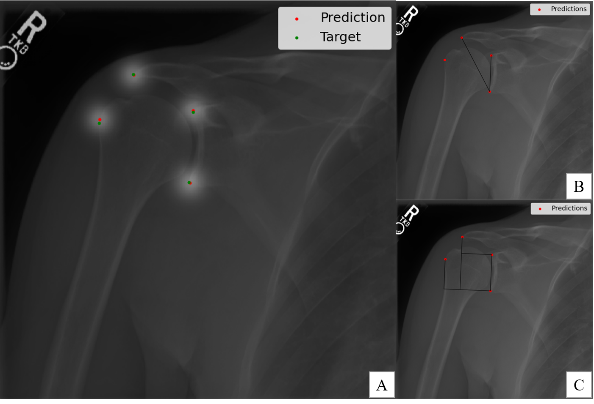
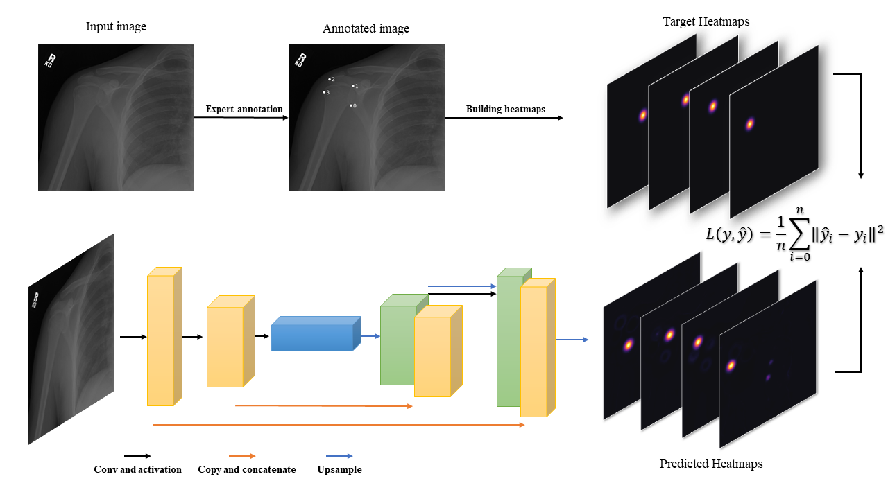

# Deep Learning Model for Measurement of Shoulder Critical Angle and Acromion Index on Shoulder radiographs

This repo hosts the code for our paper <em>"Deep Learning Model for Measurement of Shoulder Critical Angle and Acromion Index on Shoulder radiographs"</em>. [Link](https://www.sciencedirect.com/science/article/pii/S266663912200030X) to paper

---
 
 

### Model Performance

Example of model performance in comparison to ground truth labels in prediction of landmarks

### Model architecture and training

Our model architecture and how we trained it is as follows:
